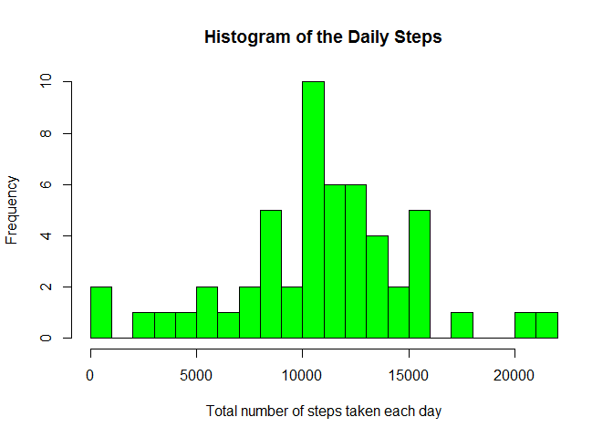
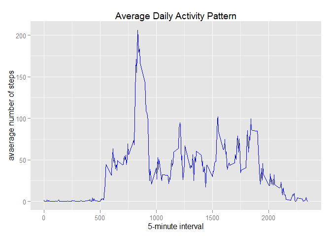
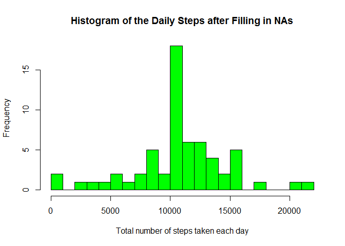
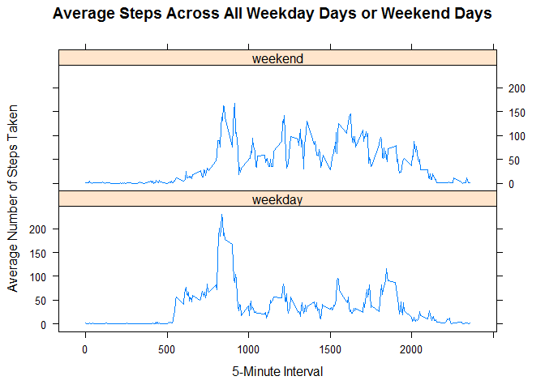

# Reproducible Research: Peer Assessment 1
## Introduction

This document presents the results of peer assessments 1 of course [**Reproducible Research**](https://class.coursera.org/repdata-010) on [**Coursera**](https://www.coursera.org). 

This assignment makes use of data from a personal activity monitoring device. This device collects data at 5 minute intervals through out the day. The data consists of two months of data from an anonymous individual collected during the months of October and November, 2012 and include the number of steps taken in 5 minute intervals each day.

This document presents the results of the Reproducible Research's Peer Assessment 1 in a report using **a single R markdown document** that can be processed by **knitr** and be transformed into an HTML file.  


## Data Source

The data for this assignment was downloaded from the above course web site on **13 Jan. 2015**.

Dataset: Activity monitoring data [52K]

The variables included in this dataset are:

- steps: Number of steps taking in a 5-minute interval (missing values are coded as NA)

- date: The date on which the measurement was taken in YYYY-MM-DD format

- interval: Identifier for the 5-minute interval in which measurement was taken

The dataset is stored in a comma-separated-value (CSV) file and there are a total of 17,568 observations in this dataset.

## Loading and preprocessing the data

The following statements are used to load the data using `read.csv()` and process the data into a format for further analysis.

```r
### load input data from the downloaded "activity.zip" file
data0 <- read.csv(unz("activity.zip","activity.csv"),header = T, sep =",")

### transform variable "date" into Date class
data<-data0
data$date <- as.Date(data$date,format = "%Y-%m-%d")

### transform variable "interval" as Factor class
data$interval <- as.factor(data$interval)
```

## What is mean total number of steps taken per day?

Now let's ignore the missing values.

1. Make a historgram of the toal number of steps taken each day

```r
### calculte the total number of steps taken each day
dailySteps <- aggregate(steps ~ date, data, sum)

### make a histogram
hist(dailySteps$steps,main="Histogram of the Daily Steps", breaks=20,xlab="Total number of steps taken each day", col = "green")
```

 

2. calculate the mean and median total number of steps taken per day

```r
dailyStepsMean <- mean(dailySteps$steps, na.rm = TRUE)
dailyStepsMedian <- median(dailySteps$steps, na.rm = TRUE)
```
The mean daily steps is **10766.189** and the median daily steps is 
**10765**.


## What is the average daily activity pattern?

1. Make a time series plot of the 5-minute interval and the average number of steps taken, averaged across all day.

```r
### calculate interval-based average steps
intervalSteps <- aggregate(steps ~ interval, data, FUN = mean, na.rm = TRUE)
interval <- as.integer(levels(intervalSteps$interval))

### make a plot using ggplot2 package
library(ggplot2)
```

```
## Warning: package 'ggplot2' was built under R version 3.1.2
```

```r
qplot(x = interval, y = intervalSteps$steps, geom ="line", color = I("blue"),
       xlab="5-minute interval", 
       ylab="avaerage number of steps",
       main="Average Daily Activity Pattern"
       )
```

 

2. Find the maximum number of steps

```r
intervalMax <- intervalSteps[which.max(intervalSteps$steps),]
```
The **835<sup>th</sup>** interval has maximum **206** steps.


## Imputing missing values

### 1. the total number of missing values

```r
totalNA <- sum(is.na(data0$steps))
```
The total number of missing values in the dataset is **2304**.

### 2. use the mean of the 5-minute interval to reaplce all of NAs

```r
NAidx <- which(is.na(data0$steps))
intInfo <- data0[NAidx,]$interval
intIdx <- unlist(lapply(1:length(intInfo), FUN = function(rowIdx) {which(intervalSteps$interval == intInfo[rowIdx])}))
```

### 3. create a new dataset with the misssing data filled in

```r
dataFill <- data0
dataFill[NAidx,]$steps <- intervalSteps[intIdx,]$steps   
```
We can check whether there are many missing values or not

```r
sum(is.na(dataFill$steps))
```

```
## [1] 0
```
Zero output means that there are **No Missing Values**.

### 4. make a histogram of the total number of steps taken each day

```r
fillDailySteps <- aggregate(steps ~ date, dataFill, sum)
hist(fillDailySteps$steps,main="Histogram of the Daily Steps after Filling in NAs", breaks=20,xlab="Total number of steps taken each day", col = "green")
```

 

### calculate the mean and median 

```r
filldailyStepsMean <- mean(fillDailySteps$steps, na.rm = TRUE)
filldailyStepsMedian <- median(fillDailySteps$steps, na.rm = TRUE)
```
- Before filling, the mean daily steps is **10766.189** and the median daily steps is **10765**.
- After filling, the mean daily steps is **10766.189** and the median daily steps is **10766.189**.

Comparing the above caulaulation results, it can be oberserved that there is slight difference on median value after imputing missing data.

### impact of imputing missing data on the estimates of the toal daily number of steps
Since the NAs are replaced by the mean for 5-minute interval, imputing missing data has *NO* impact on mean value, only makes the median value closer to the mean value.


## Are there differences in activity patterns between weekdays and weekends?
1. create a new factor in the dataset using `weekdays()` function with two levels: "weekdays"" and "weekends"

```r
Sys.setlocale("LC_TIME","English")
```

```
## [1] "English_United States.1252"
```

```r
weekdayInfo <- as.factor(weekdays(as.Date(dataFill$date)))

dataFill$Weekday <- as.factor((ifelse(weekdays(as.Date(dataFill$date)) %in% 
                             c("Saturday","Sunday"),"weekend", "weekday")))
```

###calculate mean steps over all weekdays and weekends

```r
mean_by_weekday <- aggregate(steps ~ Weekday + interval, dataFill, mean)
```

2. make a panel plot using the lattice system

```r
library("lattice")
p<- xyplot(steps ~ interval | factor(Weekday), data = mean_by_weekday, 
           layout = c(1,2),
           type = "l",
           main ="Average Steps Across All Weekday Days or Weekend Days",
           xlab="5-Minute Interval",
           ylab="Average Number of Steps Taken"
           )
print(p)
```

 

### Observations
From the above figure, it can been seen that the activities on the weekday has a clear peak at early time during a day, while the actitivies on the weekend has a distribution that is relatively flat.
